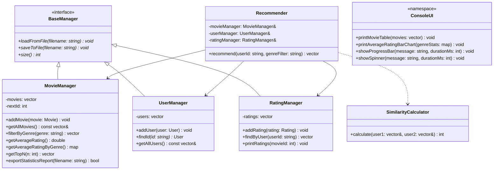

# 영화 추천 및 통계 분석 시스템 (Movie Recommender System)

본 프로젝트는 숭실대학교 컴퓨터학부 CSE2150 C++ 프로그래밍 과목의 M4 단계 최종 결과물로, 영화 평점 데이터를 기반으로 사용자 간 유사도를 계산하여 맞춤 영화를 추천하고, 통계 분석 결과를 시각화하여 보고서로 내보내는 C++ CLI 애플리케이션입니다.

---

## 1. 프로젝트 개요
사용자가 영화에 부여한 평점 데이터를 기반으로 **피어슨 유사도 개념을 변형한 협업 필터링 알고리즘(Collaborative Filtering)**을 적용해 가장 성향이 유사한 사용자를 매칭하고, 해당 사용자가 높게 평가한 영화 중 본인이 보지 않은 영화를 맞춤형으로 추천합니다. M4 단계에서는 **장르별 필터링 기능**, **장르별 평균 평점 그래프 시각화**, **랭킹 조회**, **보고서 저장(CSV/TXT)** 및 **테이블/애니메이션 기반 프리미엄 CLI**를 도입하였습니다.

---

## 2. 빌드 방법
본 프로젝트는 `Makefile`을 통해 빌드합니다. C++17 규격을 준수하는 컴파일러(`g++` 등)가 필요합니다.

```bash
# 기존 빌드 결과물 삭제 및 재빌드
make clean && make
```

---

## 3. 실행 방법
빌드가 완료되면 생성된 실행 파일을 실행하여 시스템을 가동합니다. 실행 시 `data/` 디렉터리의 CSV 파일들(`movies.csv`, `users.csv`, `ratings.csv`)이 자동으로 로드됩니다.

```bash
# 프로그램 실행
./movie_recommender
```

---

## 4. 주요 기능
*   **영화 관리**: 영화 추가, 제목 검색, 전체 목록 출력(정렬 기능 포함)
*   **사용자 관리**: 사용자 등록 및 목록 조회
*   **평점 관리**: 사용자별 영화 평점 부여(0~5점) 및 영화별 평점 통계 조회
*   **영화 추천**: 유사 사용자 기반 맞춤형 추천 (장르 필터링 지원)
*   **통계 대시보드**: 시스템 평균 평점, 장르별 평균 평점 시각화(텍스트 그래프), Top N 영화 랭킹 조회, 리포트 파일 저장

---

## 5. 클래스 구조



---

## 6. M4 확장 기능 설명

### 1) 장르 필터링 추천 (Genre Filter)
*   사용자가 영화 추천을 요청할 때 특정 장르를 입력하면, 유사도가 높은 사용자가 좋게 평가한 영화 목록 중 **해당 장르의 영화만 선별하여 추천**합니다.
*   장르를 지정하지 않을 경우 기존 방식과 동일하게 전체 장르 영화를 추천합니다.

### 2) 시스템 통계 분석 대시보드 (Advanced Statistics)
*   **장르별 평점 시각화**: `████░` 문자 대신 터미널 환경에 안전하고 깔끔하게 렌더링되는 `=` 기호를 조합하여 가로 막대 그래프(`[====================     ] 4.21 점`)로 장르별 평균 평점을 시각적으로 표시합니다.
*   **Top N 영화 랭킹**: `std::partial_sort`를 사용하여 전체 정렬 없이 효율적으로 평점 상위 N개의 영화를 도출하고 표로 출력합니다.
*   **보고서 저장**: `data/statistics_report.txt` 경로에 전체 평균, 장르별 통계, 평점 상위 5개 영화 랭킹 정보가 정리된 파일 보고서를 작성하고 저장할 수 있습니다.

### 3) 프리미엄 CLI 환경 (Table & Animation UX)
*   **정렬된 표(Table) 출력**: 클래식 ASCII 문자(`+`, `-`, `|`)와 **한글 문자 전용 Visual Width 정렬 알고리즘**(2칸 할당)을 통해 영문과 한글 제목이 섞여도 비뚤어지지 않고 정렬된 깔끔한 표 형태로 데이터를 출력합니다.
*   **동적 애니메이션**: 추천 실행 및 통계 연산 수행 시 터미널 상에서 한 줄로 업데이트되는 **로딩바(`[=======        ] 45%`)**와 **스피너(`|`, `/`, `-`, `\`)** 효과를 탑재하여 UX 동작 상태를 시각적으로 연출합니다.

---

## 7. 작성자
*   **소속**: 숭실대학교 컴퓨터학부
*   **과목**: CSE2150 C++ 프로그래밍 (Week 14 실습)
